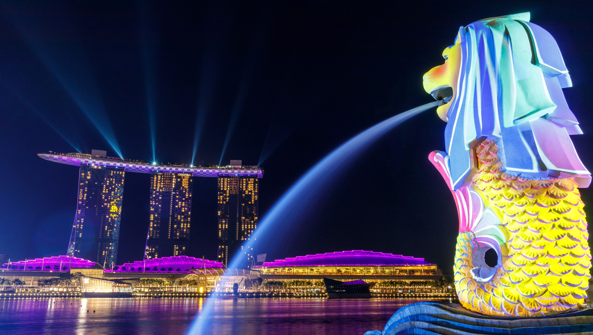
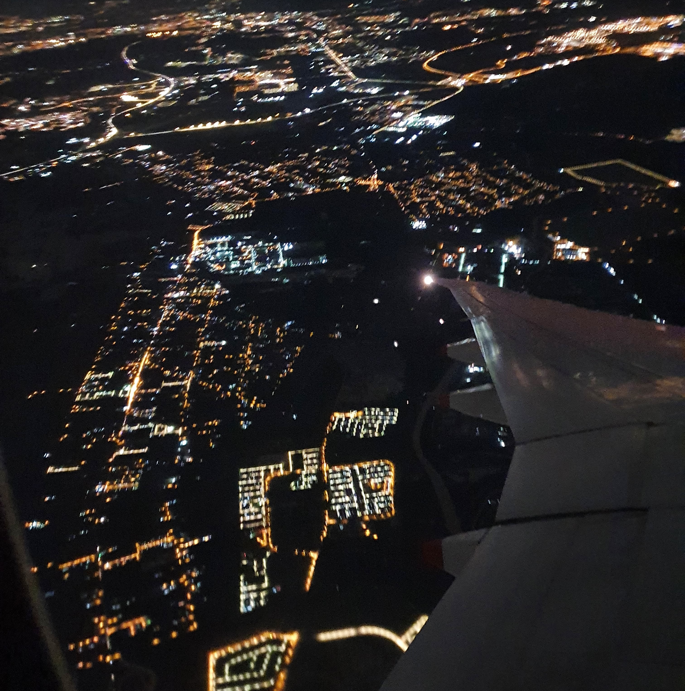
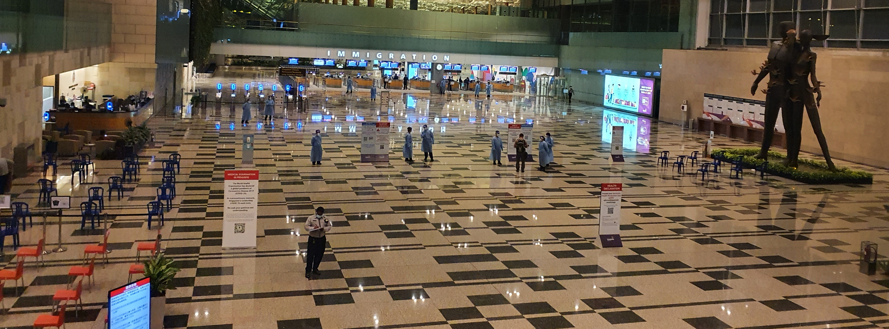
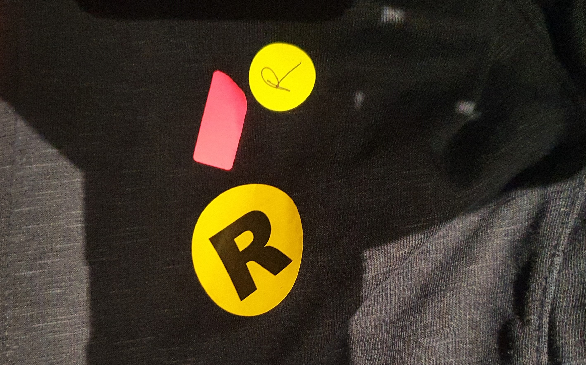
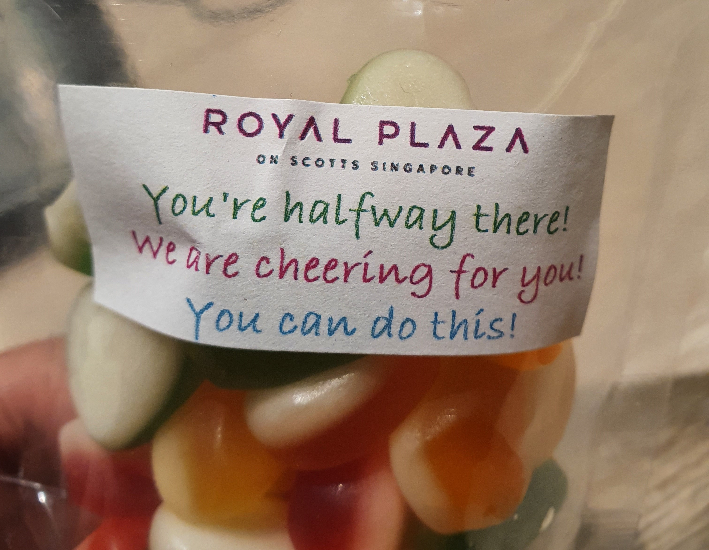
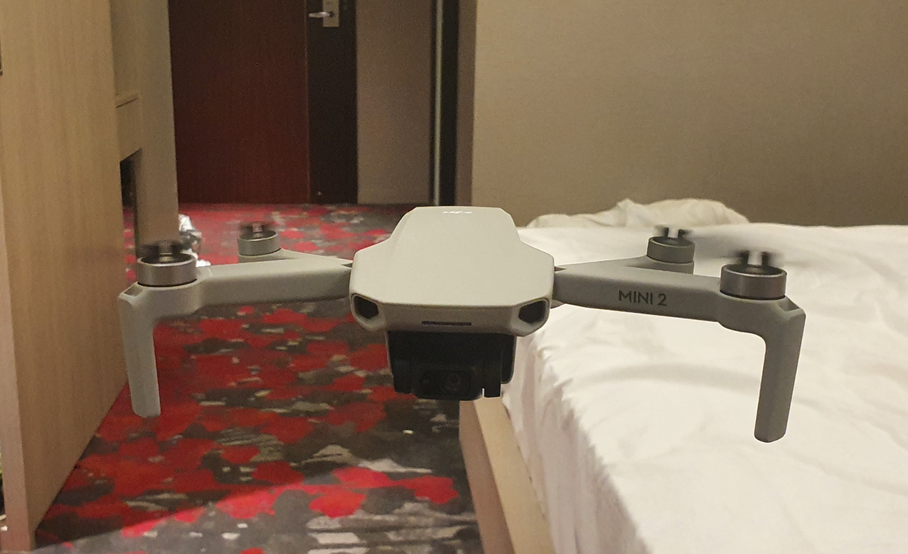
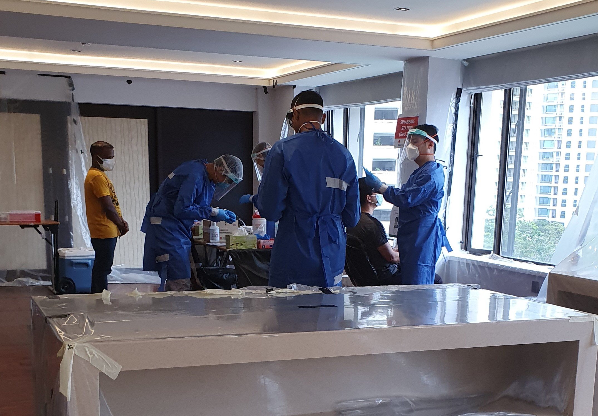

I thought moving countries would be easy, since I have already moved twice in the span of 4 years. From India to the Philippines and from the Philippines to Malaysia. The processes were smooth and simple, except for the verbal arguments with the Philippines Consulate in Chennai when I was applying for the entry visa. Not exactly your friendly Indian government official (Yes, an Indian, not a Filipino. Trust me, all Filipinos are friendly and sweet). Most Indian officials are grumpy. No, all of them.

I was expecting the same with this time. But, hell no!!! As the pandemic was raging worldwide, countries have taken drastic measures like closing the borders, quarantine in a dedicated facility and conducting PCR tests to reduce the import of the virus. And not to say, Singapore has one of most tightened borders during this time. 

So, after my Employment pass got approved, I had to get a various approval and clearance letters from the Singaporean government. The first was entry approval letter from Singapore’s Ministry of Manpower. This was processed from the employer's side. The next was to apply for SG arrival card with electronic health declaration. I had to take a pre-flight CoVID-19 PCR test, 72 hours before flight from a government approved hospital. Luckily, I tested negative, given my Malaysia visa was already shortened and exit flight was booked long before I took the test. If I had tested positive, God knows what would have happened, with an expired visa and no place to stay... OMG that is frightening just to think of the risk I undertook. 

At the Singapore Immigration, my passport was checked by 2 officers, for 15 minutes. They scanned through all the pages in my passport. Their only concern: whether I had to travelled to India in the past 14 days since my home country was literally burning with no plan of action in place to control the virus. 

Once entry was stamped, woo-hoo!!!. But, no, I had to hold my horses, I had to take another swab test, for which I had paid even before reaching the island-city-state. I had to go through 5 checkpoints and got 3 yellow stickers on my jacket each indicating different reasons like cleared immigration, paid for swab test and I forgot the third, gosh it was late and I was sleepy...

Then I was asked to board a non-descript white panelled bus. HeHeHe. Nah, I was asked to board a bus commissioned by the SG government, one person for 2 seats on each side to travel to the dedicated stay at home facility for 2-week quarantine. My travel from KL airport to Changi was 46 minutes to be exact, but the bus ride from Changi airport to the Dedicated Stay at home facility was more than hour.

> *Hey squinty! The gas pedal is on the right!!!*  
>
– Dr. Bernadette Maryann Rostenkowski-Wolowitz, The Big Bang Theory

I checked in at the hotel which is now functioning as quarantine facility at around 1 AM, had a warm shower and slept like a baby until noon that day. I was highly skeptical of the place, but I got a good quality hotel with neat food three times a day for the past 7 days. Halfway there. And 7 more days to go.....

Besides The Big Bang Theory, I flew my drone with in my hotel room couple of times. Hehehe...

**Update as of 19th May 2021**

I'm out of quarantine for 2 weeks after a successful NEGATIVE Covid19 Swab Test. Phewww!!! Maybe this was the only test for which I prayed so hard to be negative. 

House hunting in process...(Damn that is so hard during this time.)
