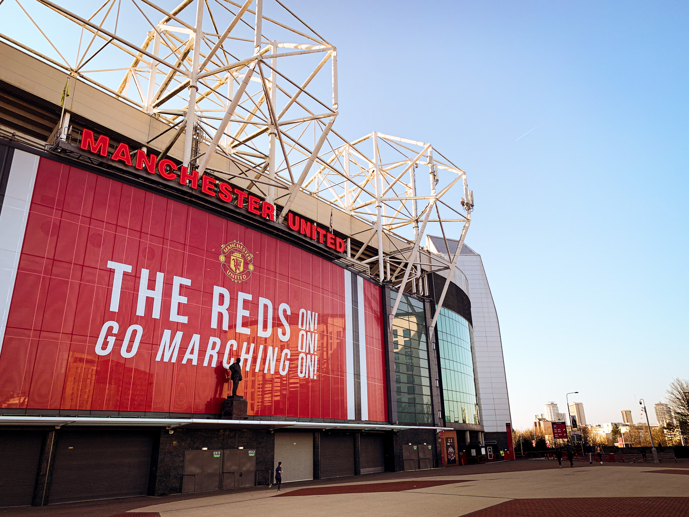

It has been a while...

Half a year ago, up stepped De Gea to take the 11th penatly of the UEFA European League final, it was a lost cause. I knew he would miss it. He was on a poor run of form and what do you expect from a Goal Keeper. Mindset. Mentality. Leadership. Management. Everything was wrong from the start of the whistle. He missed the penalty. Manchester United lost the final to the Spanish team, Villareal. No silverware for the past 3 years. And this moment was the exact downfall of my club's legend Ole Solskjaer.

The beloved and most respected Baby-faced Assasin has won it all at the club as a player. He gave it all to win it as a manager, but did not cross the line when it needed the most. But he instilled United's DNA back into the club, after pointless managment changes in the past 8 years.

Ole brought back the smiling factor. Cleared the air of negativity that always came down with the Manchester rain. The mentality to comeback everytime the team was down in goals. He will always be remembered for the night at Paris. The longest away unbeaten record. Crushing Pep 3 times in a season. 

>*Mountains are there to climbed aren't they?*  
>
– Ole Gunnar Solskjaer

Most of all for the best signings United have closed in recent memory - Sancho, Varane and "that boy" Cristiano Ronaldo.

>*He plays on the left...*    
*He plays on the right...*    
*THAT BOY RONALDO...*   
*He makes England looks shite*
>
– A Man United Chant

Now he has left the club after a string of poor performances and a new German Interim manager has taken his place. Ironically the United fans chant for Ole is always *"Who put the ball in the Germans' net? OLE GUNNAR SOLSKJAER!!!"* referring to the famous 1999 Champions League final, the corner from Becks to Teddy to Solskjaer tapping it into the top of the Bayern Munich's net winning the TREBLE (only English team to do so). Those days have gone by and is a distant memory now. It is now to save and finish in a respectable position at the end of the season.

Good luck to the number 20 who wanted to win the 21, to whatever role he moves to in the future.

And the Reds keep marching on!!!

